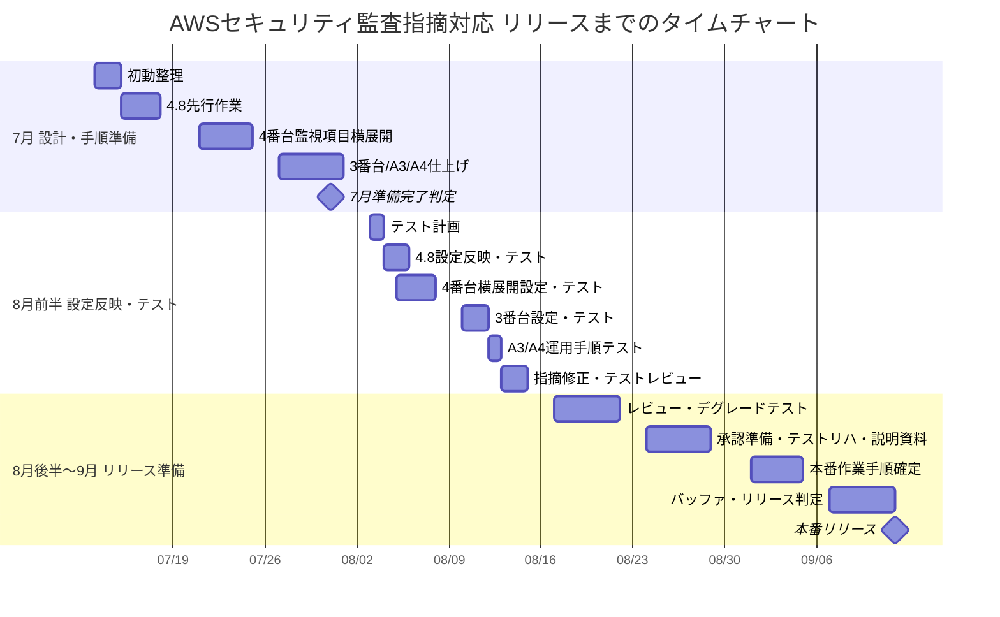

# AWS Reference

AWS上にWebアプリケーション基盤を構築し、AWSセキュリティ・ネットワーク改善案件で使う確認手順、CLIリファレンス、作業手順書、証跡取得方法を整理するためのリポジトリ。

VPC、Subnet、EC2、ALB、RDS、S3、Route 53、ACM、SES、ElastiCache、CloudTrail、CloudWatch、GuardDutyなどを対象に、AWS CLIとシェルスクリプトで構築・確認・削除できるようにする。

## リリースまでのタイムチャート

7月中は現状調査、対象範囲整理、設計、手順書、設定値案の作成までを完了目標とする。
実際の設定反映とテストは8月前半に実施する計画とする。

## 直近作成資料

WBS以降に作成・更新した、現場で直近使う資料。

| 用途 | リンク |
| :--- | :--- |
| WBS案をExcel貼り付け用の表で確認したい | [AWSセキュリティ監査指摘対応 WBS案](./aws_security_remediation_wbs_2026_07.md) |
| 想定される業務影響と確認観点を整理したい | [AWSセキュリティ監査指摘対応 業務影響整理](./aws_security_remediation_business_impact_2026_07.md) |
| 要件3番台のログ保全・KMS・VPC Flow LogsをWebコンソールで現状調査したい | [要件3番台 Webコンソール現状調査手順書](./requirements_3_x_logging_kms_vpcflow_current_state_investigation_web_console_2026_07.md) |
| 要件4.8以外の4番台監視項目をWebコンソールで一括現状調査したい | [要件4番台 Webコンソール一括現状調査手順書](./requirements_4_x_remaining_monitoring_current_state_investigation_web_console_2026_07.md) |
| 要件A3/A4のセキュリティアラート監視運用手順を作成したい | [要件A3/A4 セキュリティアラート監視運用手順書](./requirements_A3_A4_security_alert_monitoring_operation_procedure_2026_07.md) |

## 現場用クイックリファレンス

| 用途 | リンク |
| :--- | :--- |
| AWS CLI利用の相談・設定・`.aws`テンプレートを確認したい | [AWS CLI利用リファレンス](./day-learning/00_AWS_CLI_Work_Reference.md) |
| AWS CLIで必要なIAM権限一覧を確認したい | [AWS CLI必要権限一覧](./aws_cli_required_permissions_2026_07.md) |
| 匿名化した改善計画を確認したい | [改善計画](./改善計画.md) |
| 全要件番号ごとの必要情報・確認事項を確認したい | [要件別 必要情報・確認事項一覧](./requirements_questions_for_stakeholders_2026_07.md) |
| Excelへ貼り付ける要件別の対応内容を確認したい | [要件別 対応内容 Excel貼り付け用](./requirements_action_contents_for_excel_2026_07.md) |
| WBS案をExcel貼り付け用の表で確認したい | [AWSセキュリティ監査指摘対応 WBS案](./aws_security_remediation_wbs_2026_07.md) |
| 7月中の対応スケジュールをタイムチャートで確認したい | [AWSセキュリティ監査指摘対応 タイムチャート](./aws_security_remediation_timeline_2026_07.md) |
| Mermaidガントチャートの使い方とテンプレートを確認したい | [Mermaidガントチャート リファレンス](./mermaid_gantt_reference.md) |
| 設定変更前にCloudTrail・CloudWatch連携・通知基盤の現状を棚卸ししたい | [AWS現状調査リファレンス](./day-learning/00_AWS_Current_State_Investigation_Reference.md) |
| 評価シートの確認項目に沿って現状調査を実施したい | [AWSセキュリティ監査指摘 現状調査手順書](./aws_current_state_investigation_procedure_2026_07.md) |
| 金融現場でのアラート通知設定のヒアリング・AWS設定方法を確認したい | [AWSアラート通知設定リファレンス](./day-learning/00_AWS_Alert_Notification_Reference.md) |
| 監査指摘対応の作業計画たたき台を確認したい | [AWSセキュリティ監査指摘対応 作業計画](./aws_security_remediation_work_plan_2026_07.md) |
| 先行テスト作業の要件番号・作業内容・選定理由を確認したい | [先行テスト作業候補](./pilot_work_selection_2026_07.md) |
| 要件4.8のS3バケットポリシー変更監視をパイロット実施したい | [要件4.8 S3バケットポリシー変更監視 パイロット作業手順書](./requirement_4_8_s3_bucket_policy_monitoring_pilot_procedure_2026_07.md) |
| 要件4.8をWebコンソールで現状調査したい | [要件4.8 Webコンソール現状調査手順書](./requirement_4_8_web_console_investigation_procedure_2026_07.md) |
| 要件4.8をWebコンソールで設定・テストしたい | [要件4.8 Webコンソール作業実施手順書](./requirement_4_8_web_console_work_procedure_2026_07.md) |
| 要件4.8以外の4番台監視項目をWebコンソールで一括現状調査したい | [要件4番台 Webコンソール一括現状調査手順書](./requirements_4_x_remaining_monitoring_current_state_investigation_web_console_2026_07.md) |
| 要件4.8について関係者への確認事項と必要権限を整理したい | [要件4.8 確認事項・最低限必要権限整理](./requirement_4_8_questions_and_minimum_permissions_2026_07.md) |
| 要件A3/A4のセキュリティアラート監視運用手順を作成したい | [要件A3/A4 セキュリティアラート監視運用手順書](./requirements_A3_A4_security_alert_monitoring_operation_procedure_2026_07.md) |
| リーダーへ確認する事項を整理したい | [リーダー確認事項](./leader_confirmation_items_2026_07.md) |

## 目的別目次

| 目的 | 見るもの |
| :--- | :--- |
| 全体構成を確認したい | [設計書](./docs/design/Design_Specification.md)、[ネットワーク構成図](./docs/design/Network_Architecture.png) |
| AWS CLIの共通作法を確認したい | [共通AWS CLI・証跡保存リファレンス](./docs/references/00_common_aws_cli_reference.md) |
| AWSセキュリティ設定を横断的に確認したい | [AWS Security Settings 横断チェックリスト](./docs/references/90_aws_security_settings_checklist.md) |
| AWSネットワーク設定を横断的に確認したい | [AWS Network Settings 横断チェックリスト](./docs/references/91_aws_network_settings_checklist.md) |
| S3のセキュリティ設定を確認したい | [S3セキュリティ設定CLIリファレンス](./docs/references/01_s3_security_cli_reference.md) |
| S3バケットポリシー変更の影響調査をしたい | [S3 Bucket Policy CLIリファレンス](./docs/references/02_s3_bucket_policy_cli_reference.md)、[S3バケットポリシー変更ケーススタディ](./docs/case_studies/case_study_s3_bucket_policy_change.md) |
| オンプレミス、S3、CloudTrail、GuardDutyの関係を理解したい | [オンプレミス、S3、CloudTrail、GuardDutyのつながり](./docs/case_studies/case_study_onpremises_s3_cloudtrail_guardduty.md) |
| CloudTrailのログや変更履歴を確認したい | [CloudTrail CLIリファレンス](./docs/references/03_cloudtrail_cli_reference.md) |
| CloudWatch Logs / Alarmを確認したい | [CloudWatch CLIリファレンス](./docs/references/04_cloudwatch_cli_reference.md) |
| GuardDuty Findingを確認したい | [GuardDuty CLIリファレンス](./docs/references/05_guardduty_cli_reference.md) |
| MFAなし管理コンソールログインを検知したい | [MFAなし管理コンソールログイン検知手順](./docs/references/06_mfa_console_login_detection.md) |
| VPC / SG / NACL / Routeの通信影響調査をしたい | [VPC/Network CLIリファレンス](./docs/references/07_vpc_network_cli_reference.md) |
| EC2 / IAM Role / IMDSv2 / EBS暗号化を確認したい | [EC2 Security CLIリファレンス](./docs/references/08_ec2_security_cli_reference.md) |
| RDSのPublic設定、暗号化、SG、ログ、バックアップを確認したい | [RDS Security CLIリファレンス](./docs/references/09_rds_security_cli_reference.md) |
| LambdaのIAM Role、VPC、環境変数、ログ、Function URLを確認したい | [Lambda Security CLIリファレンス](./docs/references/10_lambda_security_cli_reference.md) |
| RailsアプリをEC2へデプロイしたい | [Railsアプリケーションデプロイ手順](./ansible/10_rails_app_deploy.md)、[Ansible README](./ansible/README.md) |
| 日次ラボ環境を一括構築したい | [All_Setup.sh](./scripts/All_Setup.sh) |
| 検証後にリソースを削除したい | [cleanup_network.sh](./scripts/cleanup_network.sh)、[check_cleanup.sh](./scripts/check_cleanup.sh) |
| 作業手順書テンプレートを使いたい | [Markdown版](./docs/templates/s3_bucket_policy_change_procedure_template.md)、[Excel版](./docs/templates/s3_bucket_policy_change_procedure_template.xlsx) |
| 案件初日までの学習計画を確認したい | [2026-06-05 to 2026-06-30 案件対策ロードマップ](./docs/roadmaps/2026-06-05_to_2026-06-30_project_preparation_roadmap.md) |
| 10日間で案件対策を濃縮して進めたい | [10-Day Condensed Learning](./day-learning/00_10_Day_Condensed_Learning.md) |
| Day 1〜7を一気に復習したい | [Day 1-7 S3・CloudTrail・CloudWatch一気通し復習](./day-learning/01-07_Day_Learning_Review.md) |
| 日別の案件対策ドリルを進めたい | [Day 1 S3確認](./day-learning/01_Day_Learning.md)、[Day 2 Bucket Policy変更](./day-learning/02_Day_Learning.md)、[Day 3 CloudTrail](./day-learning/03_Day_Learning.md)、[Day 4 CloudWatch](./day-learning/04_Day_Learning.md)、[Day 5 MFAなしログイン検知設計](./day-learning/05_Day_Learning.md)、[Day 6 MFAなしログイン検知ハンズオン](./day-learning/06_Day_Learning.md)、[Day 7 CloudTrail・CloudWatch総合調査](./day-learning/07_Day_Learning.md)、[Day 8 GuardDuty基礎確認](./day-learning/08_Day_Learning.md)、[Day 9 GuardDutyサンプルFinding調査](./day-learning/09_Day_Learning.md)、[Day 10 VPC・Route Table確認](./day-learning/10_Day_Learning.md)、[Day 11 Security Group・Network ACL確認](./day-learning/11_Day_Learning.md)、[Day 12 Security Group変更影響調査](./day-learning/12_Day_Learning.md)、[Day 13 Security Group変更ドリル](./day-learning/13_Day_Learning.md)、[Day 14 DNS・VPC Endpoint・Flow Logs確認](./day-learning/14_Day_Learning.md)、[Day 15 EC2・RDS Security確認](./day-learning/15_Day_Learning.md)、[Day 16 Lambda Security確認](./day-learning/16_Day_Learning.md)、[Day 17 運用シェル基礎・読解演習](./day-learning/17_Day_Learning.md)、[Day 18 AWSセキュリティ横断チェック](./day-learning/18_Day_Learning.md)、[Day 19 作業手順書・証跡整理](./day-learning/19_Day_Learning.md)、[Day 20 模擬作業1 S3 Bucket Policy変更](./day-learning/20_Day_Learning.md)、[Day 21 模擬作業2 GuardDuty・CloudTrail横断調査](./day-learning/21_Day_Learning.md)、[Day 22 案件初日準備・受入情報整理](./day-learning/22_Day_Learning.md)、[Day 23 最終リハーサル・説明練習・公開前確認](./day-learning/23_Day_Learning.md)、[Day 24 構成図読解・影響範囲整理](./day-learning/24_Day_Learning.md)、[Day 25 予備日](./day-learning/25_Day_Learning.md)、[Day 26 現場指示型・総合演習](./day-learning/26_Day_Learning.md) |

## 日別学習

AWS Webコンソール、AWS CLI、証跡取得、結果報告を組み合わせた案件対策ドリル。

| Day | テーマ | リンク |
| :--- | :--- | :--- |
| Condensed | 10日間案件対策濃縮版 | [00_10_Day_Condensed_Learning.md](./day-learning/00_10_Day_Condensed_Learning.md) |
| Review | Day 1〜7 S3・CloudTrail・CloudWatch一気通し復習 | [01-07_Day_Learning_Review.md](./day-learning/01-07_Day_Learning_Review.md) |
| Day 1 | S3セキュリティ設定確認 | [01_Day_Learning.md](./day-learning/01_Day_Learning.md) |
| Day 2 | S3 Bucket Policy変更・テスト・切り戻し | [02_Day_Learning.md](./day-learning/02_Day_Learning.md) |
| Day 3 | CloudTrail基礎・変更履歴調査 | [03_Day_Learning.md](./day-learning/03_Day_Learning.md) |
| Day 4 | CloudWatch Logs・Metric Filter・Alarm確認 | [04_Day_Learning.md](./day-learning/04_Day_Learning.md) |
| Day 5 | MFAなし管理コンソールログイン検知の設計理解 | [05_Day_Learning.md](./day-learning/05_Day_Learning.md) |
| Day 6 | CloudWatch・MFAなしログイン検知ハンズオン | [06_Day_Learning.md](./day-learning/06_Day_Learning.md) |
| Day 7 | CloudTrail・CloudWatch総合調査ドリル | [07_Day_Learning.md](./day-learning/07_Day_Learning.md) |
| Day 8 | GuardDuty基礎確認・Finding一次調査 | [08_Day_Learning.md](./day-learning/08_Day_Learning.md) |
| Day 9 | GuardDutyサンプルFinding調査・後片付け | [09_Day_Learning.md](./day-learning/09_Day_Learning.md) |
| Day 10 | VPC・Subnet・Route Table確認 | [10_Day_Learning.md](./day-learning/10_Day_Learning.md) |
| Day 11 | Security Group・Network ACL確認 | [11_Day_Learning.md](./day-learning/11_Day_Learning.md) |
| Day 12 | Security Group変更影響調査・手順書作成 | [12_Day_Learning.md](./day-learning/12_Day_Learning.md) |
| Day 13 | Security Group変更・確認・切り戻しドリル | [13_Day_Learning.md](./day-learning/13_Day_Learning.md) |
| Day 14 | DNS・VPC Endpoint・Flow Logs確認 | [14_Day_Learning.md](./day-learning/14_Day_Learning.md) |
| Day 15 | EC2・RDS Security確認 | [15_Day_Learning.md](./day-learning/15_Day_Learning.md) |
| Day 16 | Lambda Security確認 | [16_Day_Learning.md](./day-learning/16_Day_Learning.md) |
| Day 17 | 運用シェル基礎・読解演習 | [17_Day_Learning.md](./day-learning/17_Day_Learning.md) |
| Day 18 | AWSセキュリティ横断チェック | [18_Day_Learning.md](./day-learning/18_Day_Learning.md) |
| Day 19 | 作業手順書・証跡整理 | [19_Day_Learning.md](./day-learning/19_Day_Learning.md) |
| Day 20 | 模擬作業1 S3 Bucket Policy変更 | [20_Day_Learning.md](./day-learning/20_Day_Learning.md) |
| Day 21 | 模擬作業2 GuardDuty Finding・CloudTrail横断調査 | [21_Day_Learning.md](./day-learning/21_Day_Learning.md) |
| Day 22 | 案件初日準備・受入情報整理 | [22_Day_Learning.md](./day-learning/22_Day_Learning.md) |
| Day 23 | 最終リハーサル・説明練習・公開前確認 | [23_Day_Learning.md](./day-learning/23_Day_Learning.md) |
| Day 24 | 構成図読解・影響範囲整理 | [24_Day_Learning.md](./day-learning/24_Day_Learning.md) |
| Day 25 | 予備日 | [25_Day_Learning.md](./day-learning/25_Day_Learning.md) |
| Day 26 | 現場指示型・総合演習 | [26_Day_Learning.md](./day-learning/26_Day_Learning.md) |

## 案件対策リファレンス

AWSセキュリティ・ネットワーク改善案件で使うことを意識したリファレンス。

| 領域 | リンク | 主な内容 |
| :--- | :--- | :--- |
| 共通 | [共通AWS CLI・証跡保存リファレンス](./docs/references/00_common_aws_cli_reference.md) | Account / Profile / Region確認、証跡保存、差分確認、秘密情報の扱い |
| 横断チェックリスト | [AWS Security Settings 横断チェックリスト](./docs/references/90_aws_security_settings_checklist.md) | サービス横断の確認順序、重要度、証跡、切り戻し観点 |
| ネットワーク横断チェックリスト | [AWS Network Settings 横断チェックリスト](./docs/references/91_aws_network_settings_checklist.md) | 通信経路、Route、SG、NACL、DNS、Endpoint、Flow Logsの確認索引 |
| S3 | [S3セキュリティ設定CLIリファレンス](./docs/references/01_s3_security_cli_reference.md) | Public Access Block、ACL、Object Ownership、暗号化、ログ、Versioning |
| S3 Bucket Policy | [S3 Bucket Policy CLIリファレンス](./docs/references/02_s3_bucket_policy_cli_reference.md) | Policy取得、Public判定、差分確認、変更、切り戻し、CloudTrail確認 |
| CloudTrail | [CloudTrail CLIリファレンス](./docs/references/03_cloudtrail_cli_reference.md) | Trail、Event Data Store、イベント検索、S3保存、CloudWatch Logs連携 |
| CloudWatch | [CloudWatch CLIリファレンス](./docs/references/04_cloudwatch_cli_reference.md) | Log Group、Metric Filter、Alarm、ログ検索、証跡取得 |
| GuardDuty | [GuardDuty CLIリファレンス](./docs/references/05_guardduty_cli_reference.md) | Detector、Finding、重要度、サンプルFinding、調査手順 |
| MFA検知 | [MFAなし管理コンソールログイン検知手順](./docs/references/06_mfa_console_login_detection.md) | CloudTrail、Metric Filter、Alarm、調査、切り戻し |
| VPC/Network | [VPC/Network CLIリファレンス](./docs/references/07_vpc_network_cli_reference.md) | VPC、Subnet、Route Table、SG、NACL、Endpoint、Flow Logs、通信影響調査 |
| EC2 Security | [EC2 Security CLIリファレンス](./docs/references/08_ec2_security_cli_reference.md) | EC2、IAM Role、IMDSv2、EBS暗号化、Security Group、変更履歴確認 |
| RDS Security | [RDS Security CLIリファレンス](./docs/references/09_rds_security_cli_reference.md) | Public設定、暗号化、Security Group、Parameter Group、ログ、バックアップ確認 |
| Lambda Security | [Lambda Security CLIリファレンス](./docs/references/10_lambda_security_cli_reference.md) | IAM Role、VPC、環境変数、KMS、CloudWatch Logs、Function URL確認 |
| S3変更ケーススタディ | [S3バケットポリシー変更の影響調査・設定変更・証跡取得](./docs/case_studies/case_study_s3_bucket_policy_change.md) | 変更前確認、影響調査、設定変更、テスト、切り戻し、証跡取得 |
| オンプレ・S3・監査検知ケーススタディ | [オンプレミス、S3、CloudTrail、GuardDutyのつながり](./docs/case_studies/case_study_onpremises_s3_cloudtrail_guardduty.md) | 閉域接続、S3アクセス経路、CloudTrail監査、GuardDuty検知の関係 |
| 作業手順書テンプレート | [Markdown版](./docs/templates/s3_bucket_policy_change_procedure_template.md)、[Excel版](./docs/templates/s3_bucket_policy_change_procedure_template.xlsx) | 作業概要、事前確認、変更手順、変更後確認、切り戻し、証跡一覧 |
| 汎用セキュリティ調査 | [AWSセキュリティ調査用CLIリファレンス](./docs/references/aws_security_investigation_cli_reference.md) | EC2、S3、RDS、Lambda、GuardDuty、IAM、KMS、CloudTrail、Security Hub |
| 汎用ネットワーク調査 | [AWSネットワーク調査用CLIリファレンス](./docs/references/aws_network_cli_reference.md) | VPC、Subnet、Route Table、Security Group、NACL、VPC Endpoint、Flow Logs |

## AWS CLI構築手順

AWS CLI編の構築スクリプトと解説。

| No. | 領域 | スクリプト | 解説 |
| :--- | :--- | :--- | :--- |
| 01 | VPC | [01_vpc_setup.sh](./scripts/01_vpc_setup.sh) | [01_vpc_setup.md](./docs/setup_guides/01_vpc_setup.md) |
| 02 | Subnet | [02_subnet_setup.sh](./scripts/02_subnet_setup.sh) | [02_subnet_setup.md](./docs/setup_guides/02_subnet_setup.md) |
| 03 | Internet Gateway | [03_internetgateway_setup.sh](./scripts/03_internetgateway_setup.sh) | [03_internetgateway_setup.md](./docs/setup_guides/03_internetgateway_setup.md) |
| 04 | NAT Gateway | [04_nat_gateway_setup.sh](./scripts/04_nat_gateway_setup.sh) | [04_nat_gateway_setup.md](./docs/setup_guides/04_nat_gateway_setup.md) |
| 05 | Route Table | [05_route_table_setup.sh](./scripts/05_route_table_setup.sh) | [05_route_table_setup.md](./docs/setup_guides/05_route_table_setup.md) |
| 06 | Security Group | [06_security_group_setup.sh](./scripts/06_security_group_setup.sh) | [06_security_group_setup.md](./docs/setup_guides/06_security_group_setup.md) |
| 07 | Bastion EC2 | [07_bastion_server_setup.sh](./scripts/07_bastion_server_setup.sh) | [07_bastion_server_setup.md](./docs/setup_guides/07_bastion_server_setup.md) |
| 08 | Web EC2 | [08_Web_server_setup.sh](./scripts/08_Web_server_setup.sh) | なし |
| 09 | ALB | [09_LoadBalancer_setup.sh](./scripts/09_LoadBalancer_setup.sh) | [09_LoadBalancer_setup.md](./docs/setup_guides/09_LoadBalancer_setup.md) |
| 10 | RDS | [10_Database_setup.sh](./scripts/10_Database_setup.sh) | [10_Database_setup.md](./docs/setup_guides/10_Database_setup.md) |
| 11 | S3 / IAM Role | [11_s3_setup.sh](./scripts/11_s3_setup.sh) | [11_s3_setup.md](./docs/setup_guides/11_s3_setup.md) |
| 12 | Public DNS | [12_public_dns_setup.sh](./scripts/12_public_dns_setup.sh) | [12_public_dns_setup.md](./docs/setup_guides/12_public_dns_setup.md) |
| 13 | DNS Packet Capture | なし | [13_public_dns_packet_capture.md](./docs/operations/13_public_dns_packet_capture.md) |
| 14 | Private DNS | [14_private_dns_setup.sh](./scripts/14_private_dns_setup.sh) | [14_private_dns_setup.md](./docs/setup_guides/14_private_dns_setup.md) |
| 15 | ACM / HTTPS | [15_acm_certificate_setup.sh](./scripts/15_acm_certificate_setup.sh) | [15_acm_certificate_setup.md](./docs/setup_guides/15_acm_certificate_setup.md) |
| 16 | SES送信設定 | [16_ses_setup.sh](./scripts/16_ses_setup.sh) | なし |
| 17 | SES送信テスト | [17_sendmail_test.py](./scripts/17_sendmail_test.py) | [17_sendmail_test.md](./docs/operations/17_sendmail_test.md) |
| 18 | SES受信設定 | [18_ses_receiving_setup.sh](./scripts/18_ses_receiving_setup.sh) | [18_ses_receiving_setup.md](./docs/setup_guides/18_ses_receiving_setup.md) |
| 19 | ElastiCache | [19_elasticache_setup.sh](./scripts/19_elasticache_setup.sh) | [19_elasticache_setup.md](./docs/setup_guides/19_elasticache_setup.md) |
| 20 | Web Base AMI | [20_create_web_base_ami.sh](./scripts/20_create_web_base_ami.sh) | なし |

## 一括構築・削除・確認

日次ラボ運用でよく使う入口。

| 用途 | リンク | 内容 |
| :--- | :--- | :--- |
| 一括構築 | [All_Setup.sh](./scripts/All_Setup.sh) | VPCからPrivate DNSまで主要リソースを順番に構築 |
| 削除 | [cleanup_network.sh](./scripts/cleanup_network.sh) | 日次ラボで作成した課金対象リソースを削除 |
| 削除確認 | [check_cleanup.sh](./scripts/check_cleanup.sh) | VPC、EC2、ALB、RDS、ElastiCache、DNS、S3などの残存確認 |
| コスト確認 | [check_cost.sh](./scripts/check_cost.sh) | Cost Explorerで当月コストを確認 |

## Ansible / Railsデプロイ

AWS CLIでインフラを作成した後、Private Subnet上のWeb EC2へRailsアプリを配置する。

| 用途 | リンク | 内容 |
| :--- | :--- | :--- |
| Ansible全体 | [ansible/README.md](./ansible/README.md) | Ansibleディレクトリの概要 |
| Railsデプロイ手順 | [ansible/10_rails_app_deploy.md](./ansible/10_rails_app_deploy.md) | `run_site_local.sh` 実行、RDS/S3/CloudWatch連携、確認観点 |
| Ansible参考 | [00_ansible_reference.md](./ansible/notes/00_ansible_reference.md) | Ansibleの基本確認 |
| 標準実行 | [run_site_local.sh](./ansible/run_site_local.sh) | ローカル端末からWeb EC2へPlaybookを実行 |
| 標準Playbook | [site.yml](./ansible/playbooks/site.yml) | ping、nginx、Railsアプリ、CloudWatch Agentを実行 |
| フルPlaybook | [site_full.yml](./ansible/playbooks/site_full.yml) | Rubyビルドなども含めたフル構成 |

## 補助資料

| 種別 | リンク | 内容 |
| :--- | :--- | :--- |
| 案件対策ロードマップ | [2026-06-05 to 2026-06-30 案件対策ロードマップ](./docs/roadmaps/2026-06-05_to_2026-06-30_project_preparation_roadmap.md) | 7月2日の案件初日に向けた日別学習・模擬作業計画 |
| プロジェクトメモ | [project.md](./project.md) | リポジトリや学習の全体メモ |
| 作業種別メモ | [type_of_work.md](./type_of_work.md) | 作業分類の整理 |
| 面談メモ | [mendan.md](./mendan.md) | 案件面談で確認した内容 |
| Codex作業方針 | [AGENTS.md](./AGENTS.md) | このリポジトリでのMarkdown作成・案件対策方針 |
| ネットワーク構成図ソース | [Network_Architecture.puml](./docs/design/Network_Architecture.puml) | PlantUMLの構成図ソース |
| サンプル画像 | [Suneteruzu.JPG](./images/Suneteruzu.JPG) | Railsアプリの表示確認用画像 |

## 想定構成

- Public SubnetにALB、NAT Gateway、踏み台サーバーを配置する
- Private SubnetにWebサーバー、RDS、ElastiCacheを配置する
- WebサーバーはPublic IPを持たず、踏み台サーバー経由で管理する
- ALBからPrivate Subnet上のWebサーバーへHTTP 3000番で転送する
- S3をアプリケーションのアップロード先およびSES受信メール保存先として利用する
- Route 53でPublic DNSとPrivate DNSを管理する
- ACM証明書を利用してALBをHTTPS化する
- SESでメール送信とメール受信を検証する

## 利用方針

このリポジトリは、AWS CLIによる構築手順と、実務で使う調査コマンドの参照を目的とする。

案件対策のMarkdownでは、以下の観点を入れる。

- 変更前確認
- 実施内容
- 影響範囲
- 変更後確認
- 切り戻し方法
- セキュリティ上の注意点
- 案件で説明できるポイント
- 資格試験につながるポイント

## 注意事項

- AWSリソースの作成前に、必ず `aws sts get-caller-identity` で操作対象アカウントを確認する
- 認証情報、DBパスワード、SMTPパスワード、Secret値はリポジトリに保存しない
- NAT Gateway、RDS、ElastiCacheなどの課金対象リソースは、検証後に削除する
- 調査証跡としてJSONを保存する場合は、秘密情報や個人情報が含まれていないか確認する
- 本番相当の環境では、最小権限、監査ログ、暗号化、バックアップ、監視、変更承認を前提に設計する
