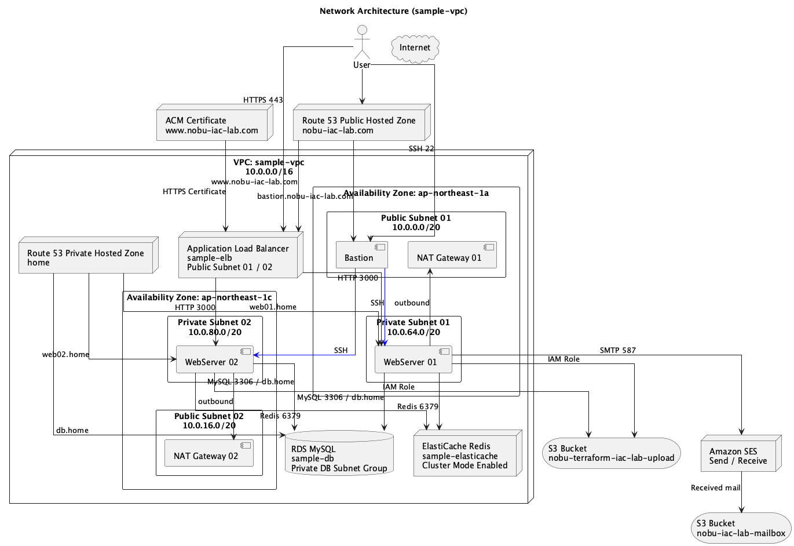

# AWS Reference

AWS上にWebアプリケーション基盤を構築するためのリファレンスリポジトリ。

VPC、Subnet、EC2、ALB、RDS、S3、Route 53、ACM、SES、ElastiCacheなどを組み合わせ、AWS CLIとシェルスクリプトでインフラを構築する流れを整理する。

後続でTerraform化することを想定し、各AWSリソースの役割、依存関係、セキュリティ設計、削除運用、調査時に使うAWS CLIコマンドを参照しやすい形でまとめる。

## ドキュメント

| 種別 | リンク | 内容 |
| :--- | :--- | :--- |
| インフラ設計書 | [AWS Webアプリケーション基盤の設計書](./docs/Design_Specification.md) | ネットワーク、サーバー、DB、DNS、メール、キャッシュ、運用方針の全体設計 |
| 案件対策S3手順 | [S3バケットポリシー変更の影響調査・設定変更・証跡取得](./docs/case_study_s3_bucket_policy_change.md) | S3バケットポリシー変更を題材に、変更前確認、影響調査、設定変更、テスト、切り戻し、証跡取得を整理 |
| 案件対策S3手順書テンプレート | [S3バケットポリシー変更 作業手順書テンプレート](./docs/templates/s3_bucket_policy_change_procedure_template.xlsx) | 作業概要、事前確認、変更手順、変更後確認、切り戻し、証跡一覧、チェックリスト、レビュー承認をExcel形式で整理 |
| VPC構築スクリプト解説 | [VPC構築スクリプトの詳細解説](./scripts/01_vpc_setup.md) | `01_vpc_setup.sh` の処理内容、前提条件、実行後の確認観点 |
| ネットワークCLIリファレンス | [AWSネットワーク調査用CLIリファレンス](./scripts/aws_network_cli_reference.md) | VPC、Subnet、Route Table、Security Group、NACL、VPC Endpoint、Flow Logsなどの確認コマンド |
| セキュリティ調査CLIリファレンス | [AWSセキュリティ調査用CLIリファレンス](./scripts/aws_security_investigation_cli_reference.md) | EC2、S3、RDS、Lambda、GuardDuty、IAM、KMS、CloudTrail、Security Hubなどの調査コマンド |

## スクリプト

| ファイル | 内容 |
| :--- | :--- |
| [`scripts/01_vpc_setup.sh`](./scripts/01_vpc_setup.sh) | VPCを作成し、DNS HostnamesとDNS Supportを有効化する |

## 想定構成

- Public SubnetにALB、NAT Gateway、踏み台サーバーを配置する
- Private SubnetにWebサーバー、RDS、ElastiCacheを配置する
- WebサーバーはPublic IPを持たず、踏み台サーバー経由で管理する
- ALBからPrivate Subnet上のWebサーバーへHTTP 3000番で転送する
- S3をアプリケーションのアップロード先およびSES受信メール保存先として利用する
- Route 53でPublic DNSとPrivate DNSを管理する
- ACM証明書を利用してALBをHTTPS化する
- SESでメール送信とメール受信を検証する

## 利用方針

このリポジトリは、AWS CLIによる構築手順と、実務で使う調査コマンドの参照を目的とする。

構築スクリプトは段階的に追加し、各スクリプトに対応する解説Markdownを配置する。調査用リファレンスは、ネットワーク観点とセキュリティ観点に分けて整理する。

## 注意事項

- AWSリソースの作成前に、必ず `aws sts get-caller-identity` で操作対象アカウントを確認する
- 認証情報、DBパスワード、SMTPパスワード、Secret値はリポジトリに保存しない
- NAT Gateway、RDS、ElastiCacheなどの課金対象リソースは、検証後に削除する
- 調査証跡としてJSONを保存する場合は、秘密情報や個人情報が含まれていないか確認する
- 本番相当の環境では、最小権限、監査ログ、暗号化、バックアップ、監視、変更承認を前提に設計する
