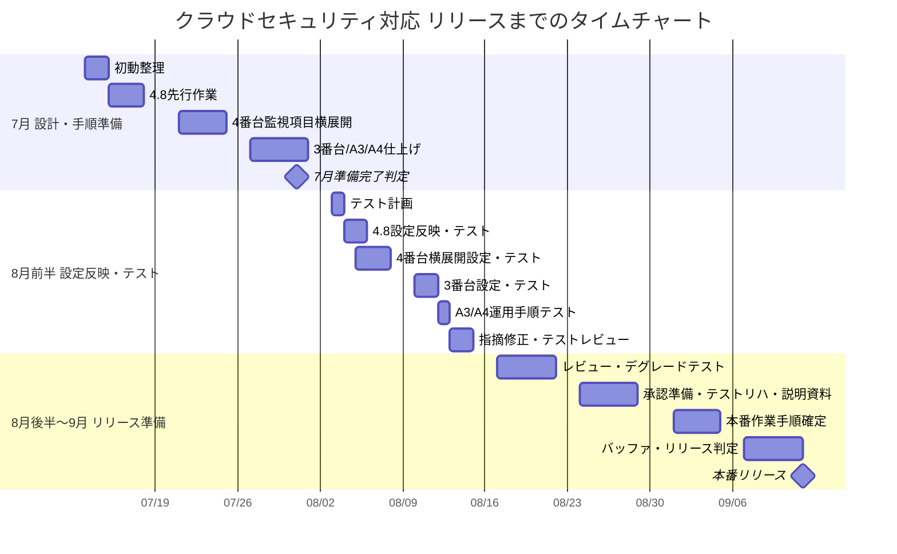

# AWS Reference

クラウドセキュリティ対応で現在使用している資料への入口です。

README直下は、現場作業で使うMarkdownだけに絞っています。

## リリースまでのタイムチャート

7月中は、現状調査、対象範囲整理、設計、手順書、設定値案の作成までを完了目標とします。
実際の設定反映とテストは、8月前半に実施する計画です。

## いま使う資料

### 計画・管理

| 用途 | 資料 |
| :--- | :--- |
| WBS案を確認する | [クラウドセキュリティ対応 WBS案](./project-docs/01_plan/aws_security_remediation_wbs_2026_07.md) |
| 7月からリリースまでの流れを確認する | [クラウドセキュリティ対応 タイムチャート](./project-docs/01_plan/aws_security_remediation_timeline_2026_07.md) |
| 作業計画の大枠を確認する | [クラウドセキュリティ対応 作業計画](./project-docs/01_plan/aws_security_remediation_work_plan_2026_07.md) |
| 想定される業務影響を確認する | [業務影響整理](./project-docs/01_plan/aws_security_remediation_business_impact_2026_07.md) |
| デグレードテスト観点を確認する | [デグレードテスト手順書](./project-docs/01_plan/aws_security_remediation_degrade_test_procedure_2026_07.md) |
| 本番作業と切り戻しの流れを確認する | [本番作業手順書・切り戻し手順書](./project-docs/03_procedures/production_release_and_rollback_runbook_2026_09.md) |
| レビュー・説明用の要約を作る | [レビュー・説明用サマリ テンプレート](./project-docs/01_plan/stakeholder_review_explanation_summary_template_2026_07.md) |
| リーダーへ確認する事項を整理する | [リーダー確認事項](./project-docs/01_plan/leader_confirmation_items_2026_07.md) |
| 削除予定VPCの影響を確認する | [削除予定VPCの影響確認・インフラチーム質問整理](./project-docs/01_plan/infra_team_questions_and_impact_2026_07.md) |

### 要件・確認事項

| 用途 | 資料 |
| :--- | :--- |
| 匿名化した改善計画を確認する | [改善計画](./project-docs/02_requirements/改善計画.md) |
| 全要件番号ごとの確認事項を確認する | [要件別 必要情報・確認事項一覧](./project-docs/02_requirements/requirements_questions_for_stakeholders_2026_07.md) |
| Excelへ貼り付ける対応内容を確認する | [要件別 対応内容 Excel貼り付け用](./project-docs/02_requirements/requirements_action_contents_for_excel_2026_07.md) |
| 評価シートの確認項目に沿って現状調査する | [クラウドセキュリティ対応 現状調査手順書](./project-docs/03_procedures/aws_current_state_investigation_procedure_2026_07.md) |

### 先行作業 4.8

| 用途 | 資料 |
| :--- | :--- |
| 4.8を先行作業として選ぶ理由と作業内容を確認する | [要件4.8 S3バケットポリシー変更監視 パイロット作業手順書](./project-docs/03_procedures/requirement_4_8_s3_bucket_policy_monitoring_pilot_procedure_2026_07.md) |
| 4.8のWebコンソール現状調査を行う | [要件4.8 Webコンソール現状調査手順書](./project-docs/03_procedures/requirement_4_8_web_console_investigation_procedure_2026_07.md) |
| 4.8のWebコンソール設定・テストを行う | [要件4.8 Webコンソール作業実施手順書](./project-docs/03_procedures/requirement_4_8_web_console_work_procedure_2026_07.md) |
| 4.8について確認事項と必要権限を整理する | [要件4.8 確認事項・最低限必要権限整理](./project-docs/03_procedures/requirement_4_8_questions_and_minimum_permissions_2026_07.md) |

### 4番台・3番台・A3/A4

| 用途 | 資料 |
| :--- | :--- |
| 4.8以外の4番台監視項目をWebコンソールで一括調査する | [要件4番台 Webコンソール一括現状調査手順書](./project-docs/03_procedures/requirements_4_x_remaining_monitoring_current_state_investigation_web_console_2026_07.md) |
| 4番台の監視設定値案を確認する | [要件4番台 監視設定値一覧 設計パラメータ案](./project-docs/03_procedures/requirements_4_x_monitoring_parameter_design_2026_07.md) |
| 4番台のWebコンソール設定・テストを行う | [要件4番台 Webコンソール作業実施手順書](./project-docs/03_procedures/requirements_4_x_web_console_work_procedure_2026_07.md) |
| 3番台のログ保全・KMS・VPC Flow LogsをWebコンソールで調査する | [要件3番台 Webコンソール現状調査手順書](./project-docs/03_procedures/requirements_3_x_logging_kms_vpcflow_current_state_investigation_web_console_2026_07.md) |
| 3番台のWebコンソール設定・テストを行う | [要件3番台 Webコンソール作業実施手順書](./project-docs/03_procedures/requirements_3_x_web_console_work_procedure_2026_07.md) |
| A3/A4のセキュリティアラート監視運用手順を確認する | [要件A3/A4 セキュリティアラート監視運用手順書](./project-docs/03_procedures/requirements_A3_A4_security_alert_monitoring_operation_procedure_2026_07.md) |
| A3/A4の運用証跡テンプレートを確認する | [要件A3/A4 セキュリティアラート運用証跡テンプレート](./project-docs/03_procedures/requirements_A3_A4_security_alert_operation_evidence_template_2026_07.md) |
| 通知先と通知テストを整理する | [通知設計・通知先一覧・通知テスト手順](./project-docs/03_procedures/notification_design_and_test_plan_2026_07.md) |

### 参照資料

| 用途 | 資料 |
| :--- | :--- |
| AWS機能ごとの対象範囲を確認する | [AWS機能別 対象範囲確認リファレンス](./project-docs/04_references/aws_service_scope_reference_2026_07.md) |
| CloudTrailの公式ドキュメント要約を確認する | [AWS公式ドキュメント CloudTrail要約](./project-docs/04_references/aws_official_docs_cloudtrail_summary.md) |
| CloudWatch / CloudWatch Logsの公式ドキュメント要約を確認する | [AWS公式ドキュメント CloudWatch / CloudWatch Logs要約](./project-docs/04_references/aws_official_docs_cloudwatch_summary.md) |
| EventBridgeの公式ドキュメント要約を確認する | [AWS公式ドキュメント EventBridge要約](./project-docs/04_references/aws_official_docs_eventbridge_summary.md) |
| GuardDutyの公式ドキュメント要約を確認する | [AWS公式ドキュメント GuardDuty要約](./project-docs/04_references/aws_official_docs_guardduty_summary.md) |
| Security Hubの公式ドキュメント要約を確認する | [AWS公式ドキュメント Security Hub要約](./project-docs/04_references/aws_official_docs_securityhub_summary.md) |
| KMS / CMKの公式ドキュメント要約を確認する | [AWS公式ドキュメント KMS / CMK要約](./project-docs/04_references/aws_official_docs_kms_cmk_summary.md) |
| VPC Flow Logsの公式ドキュメント要約を確認する | [AWS公式ドキュメント VPC Flow Logs要約](./project-docs/04_references/aws_official_docs_vpc_flow_logs_summary.md) |
| S3の公式ドキュメント要約を確認する | [AWS公式ドキュメント S3要約](./project-docs/04_references/aws_official_docs_s3_summary.md) |
| CLI利用可否や必要権限を確認する | [AWS CLI必要権限一覧](./project-docs/04_references/aws_cli_required_permissions_2026_07.md) |

## 使い分け

| 状況 | 最初に見る資料 |
| :--- | :--- |
| 今週・来週の動き方を確認したい | [WBS案](./project-docs/01_plan/aws_security_remediation_wbs_2026_07.md) |
| 作業影響を説明したい | [業務影響整理](./project-docs/01_plan/aws_security_remediation_business_impact_2026_07.md) |
| 4.8を進めたい | [要件4.8 Webコンソール現状調査手順書](./project-docs/03_procedures/requirement_4_8_web_console_investigation_procedure_2026_07.md) |
| 4番台をまとめて調査したい | [要件4番台 Webコンソール一括現状調査手順書](./project-docs/03_procedures/requirements_4_x_remaining_monitoring_current_state_investigation_web_console_2026_07.md) |
| 3番台を調査したい | [要件3番台 Webコンソール現状調査手順書](./project-docs/03_procedures/requirements_3_x_logging_kms_vpcflow_current_state_investigation_web_console_2026_07.md) |
| A3/A4の運用手順を確認したい | [要件A3/A4 セキュリティアラート監視運用手順書](./project-docs/03_procedures/requirements_A3_A4_security_alert_monitoring_operation_procedure_2026_07.md) |

## 注意事項

- このREADMEは、現場作業で使う資料への入口として管理します。
- 機密情報、顧客名、アカウントID、IPアドレス、メールアドレス、証跡の生ログは公開用資料に含めません。
- Webコンソールで作業する前提の手順書を優先します。
- CLI関連資料は、CLI利用が許可された場合の補助資料として扱います。
