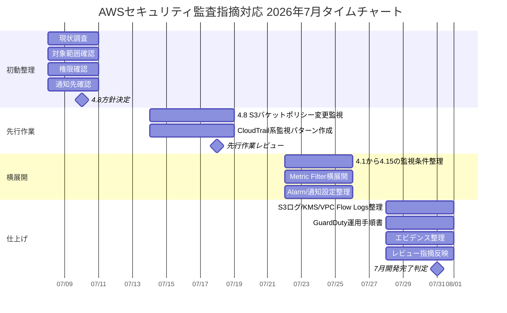

# AWSセキュリティ監査指摘対応 タイムチャート

作成日: 2026-07-08

この資料は、7月中の開発完了を目指すための作業タイムチャートである。
公開・共有しやすいように、顧客名、案件名、環境名、AWSアカウントID、具体的なリソース名は記載しない。

## 1. 前提

- 7月中に開発・設定作成を完了させる。
- 8月前半にテスト、通知確認、証跡整理を実施する。
- 最終リリース日は 2026-09-12 を想定する。
- 監視系要件は、CloudTrail、CloudWatch Logs、Metric Filter、CloudWatch Alarm、通知先を中心に整理する。
- EventBridgeは元要件の必須方式ではなく、既存通知や代替実装の確認観点として扱う。

## 2. 全体タイムチャート

| 期間 | 主な作業 | 到達目標 | 主な成果物 |
|---|---|---|---|
| 2026-07-08〜2026-07-10 | 現状調査、対象範囲確認、権限確認、通知先確認、先行作業4.8の方針決定 | 作業対象、権限、通知先、先行作業の進め方を決める | 現状調査メモ、確認事項一覧、作業方針 |
| 2026-07-14〜2026-07-18 | 4.8を先行実施、CloudTrail系監視の共通パターン作成 | S3バケットポリシー変更監視を小さく成功させ、横展開の型を作る | 4.8設定案、Metric Filter/Alarmテンプレート、テスト証跡 |
| 2026-07-22〜2026-07-25 | 4.1〜4.15を横展開、CloudWatch/Alarm/通知設定の整理 | 監視アラート系要件を共通パターンで展開する | 監視設定一覧、Alarm一覧、通知設定一覧、手順書案 |
| 2026-07-28〜2026-07-31 | S3ログ、KMS、VPC Flow Logs、GuardDuty手順書、エビデンス整理、レビュー指摘反映 | 設定変更系と運用手順系を整理し、7月末時点の開発完了状態にする | 設定手順書、運用手順書、レビュー反映版、証跡一式 |

## 3. Mermaidガントチャート

## 4. 必須確認

監視系要件を進める前に、以下を必ず確認する。

| 確認対象 | 確認内容 | 理由 |
|---|---|---|
| CloudTrail | Trailの有無、対象リージョン、Multi Region、Organization Trail、ログ記録状態 | 監視元の操作ログが記録されていることを確認するため |
| CloudWatch Logs | CloudTrail連携先Log Group、保持期間、KMS、イベント配送状況 | Metric Filterの入力元を確認するため |
| Metric Filter | 既存Filter、対象イベント、Metric Namespace、Metric Name | 既存監視との重複を避けるため |
| CloudWatch Alarm | 既存Alarm、状態、しきい値、評価期間、通知Action | 通知設計と重複確認のため |
| SNS等の通知先 | Topic、Subscription、承認状態、通知先、運用担当 | アラートが実際に届く経路を確認するため |

## 5. 補足確認

EventBridgeは元要件の必須方式ではないが、既存環境に同等監視が存在する可能性があるため確認する。

| 確認対象 | 確認内容 | 理由 |
|---|---|---|
| EventBridge Rule | CloudTrailイベントやGuardDuty Findingを拾う既存Ruleがあるか | 同じ通知を重複作成しないため |
| EventBridge Target | SNS、Lambda、Step Functions、監視基盤などに連携しているか | 既存の通知・自動対応経路を把握するため |
| 監視製品/SIEM | CloudTrailやGuardDutyのイベントを別基盤で監視しているか | AWS側にAlarmがなくても同等統制がある可能性があるため |

## 6. 期間別チェックポイント

### 2026-07-08〜2026-07-10

- 対象AWSアカウント、対象環境、対象リージョンを確認する。
- CloudTrail、CloudWatch Logs、Metric Filter、Alarm、SNS等の現状を確認する。
- CLI利用可否と必要権限を確認する。
- 通知先と運用担当を確認する。
- 4.8を先行作業として実施してよいか確認する。

### 2026-07-14〜2026-07-18

- 4.8の対象範囲を確定する。
- S3バケットポリシー変更イベントを確認する。
- Metric FilterとAlarmの設定案を作る。
- 検証可能な環境で通知テストを実施する。
- 4.1〜4.15へ横展開できるテンプレートを作成する。

### 2026-07-22〜2026-07-25

- 4.1〜4.15の監視対象イベントを整理する。
- 共通テンプレートを使ってMetric FilterとAlarmを横展開する。
- 通知設定を一覧化する。
- 既存EventBridge Ruleや監視製品との重複を確認する。
- 手順書案と設定一覧をレビューに出す。

### 2026-07-28〜2026-07-31

- CloudTrailログ保存先S3のServer Access Logging方針を整理する。
- CloudTrailログ暗号化のKMS/CMK方針を整理する。
- VPC Flow Logsの有効化対象と保存先を整理する。
- GuardDuty検知時の運用手順書を整備する。
- エビデンス、テスト結果、レビュー指摘反映をまとめる。

## 7. 7月末時点の完了条件

| 区分 | 完了条件 |
|---|---|
| 現状調査 | 対象範囲、既存設定、既存通知、権限不足が整理されている |
| 監視設定 | 4.1〜4.15の監視方針、Metric Filter、Alarm、通知先が整理されている |
| 先行作業 | 4.8で設定、テスト、通知、証跡取得の流れを確認済み |
| 設定変更系 | S3ログ、KMS、VPC Flow Logsの対応方針と手順案がある |
| 運用手順 | GuardDuty等のアラート確認、異常判定、エスカレーション、対応記録が手順化されている |
| 証跡 | CLI出力、画面キャプチャ、通知受信結果、レビュー記録が保存されている |

## 8. 注意点

- EventBridgeを必須方式として扱わない。元要件の中心はCloudTrail、CloudWatch Logs、Metric Filter、Alarmである。
- 本番環境の設定変更は、承認、作業手順、戻し手順、作業時間帯を確認してから実施する。
- KMS Key Policy、S3 Bucket Policy、CloudTrail停止・削除に関わる権限は影響が大きいため慎重に扱う。
- 通知テストは運用担当に事前周知する。
- 既存監視がある場合は、二重通知にならないように設計する。
