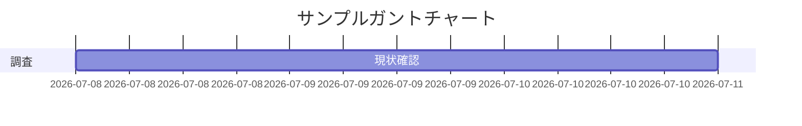
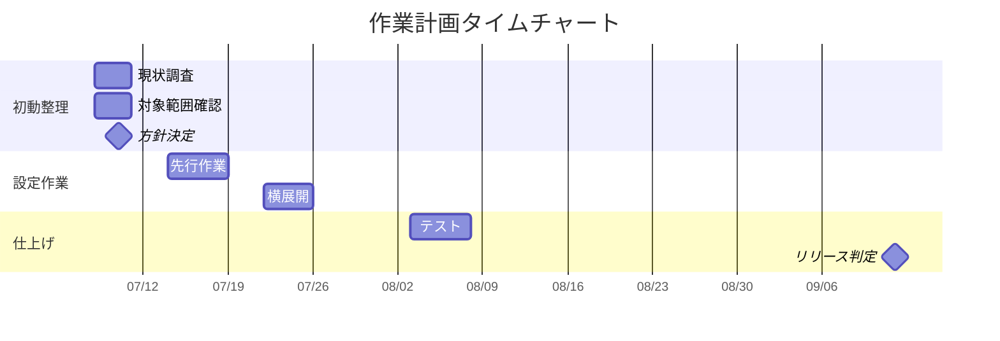
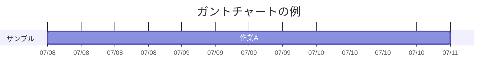
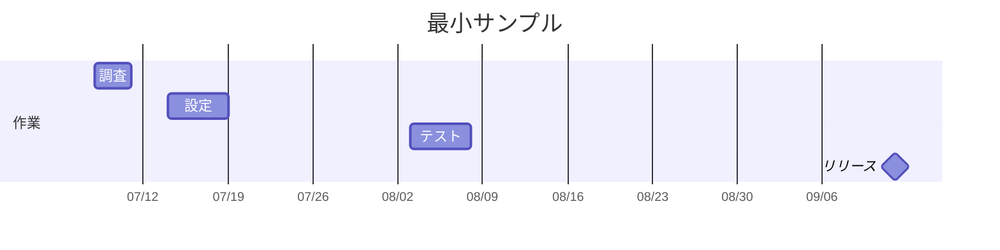

# Mermaidガントチャート リファレンス

作成日: 2026-07-08

この資料は、Markdown内で作業計画や簡易スケジュールを見える化するためのMermaidガントチャートの使い方をまとめたものである。

## 1. Mermaidとは

Mermaidは、Markdown内にテキストで図を記述するための記法である。

ExcelやPowerPointの図形で作るのではなく、以下のようなテキストを書き、対応ビューアで図として表示する。

````markdown

````

GitHub上では、Mermaidに対応しているため、Markdownファイルを表示すると図として描画される。

## 2. 現場での説明例

リーダーや関係者に説明を求められた場合は、以下のように説明するとよい。

> Markdown上でスケジュールを見える化するために、Mermaidという記法でガントチャートを書いています。
> 実体はテキストなのでGit管理しやすく、必要に応じてExcelやPowerPointへ転記できます。
> 正式な工程表ではなく、作業計画のたたき台として使う想定です。

## 3. 使う理由

| 理由 | 内容 |
|---|---|
| Git管理しやすい | テキストなので差分が見やすい |
| 修正しやすい | 日付や作業名を直接書き換えられる |
| READMEや手順書に埋め込める | Markdownの中で表と図を一緒に管理できる |
| たたき台に向いている | 正式資料化する前に作業の流れを共有しやすい |

## 4. 基本テンプレート

以下をコピーして、作業名と日付を書き換える。

````markdown

````

## 5. 記述ルール

### 5.1 `gantt`

ガントチャートを書くことを示す。



### 5.2 `title`

チャートのタイトルを指定する。

```text
title AWSセキュリティ監査指摘対応 2026年7月タイムチャート
```

### 5.3 `dateFormat`

日付の書式を指定する。

```text
dateFormat  YYYY-MM-DD
```

この指定をしている場合、作業開始日は `2026-07-08` のように書く。

### 5.4 `axisFormat`

横軸の日付表示を指定する。

```text
axisFormat  %m/%d
```

この例では、横軸が `07/08` のように表示される。

### 5.5 `section`

作業をグループ分けする。

```text
section 初動整理
```

例:

```text
section 初動整理
section 先行作業
section 横展開
section 仕上げ
```

### 5.6 通常タスク

通常の作業は以下の形式で書く。

```text
作業名 :タスクID, 開始日, 期間
```

例:

```text
現状調査 :a1, 2026-07-08, 3d
```

意味:

| 要素 | 意味 |
|---|---|
| `現状調査` | 表示される作業名 |
| `a1` | タスクID。重複しなければよい |
| `2026-07-08` | 開始日 |
| `3d` | 3日間 |

### 5.7 マイルストーン

方針決定やリリース判定など、期間ではなく節目を表す場合は `milestone` を使う。

```text
4.8方針決定 :milestone, a5, 2026-07-10, 0d
```

意味:

| 要素 | 意味 |
|---|---|
| `milestone` | 節目として表示する指定 |
| `a5` | タスクID |
| `2026-07-10` | 節目の日付 |
| `0d` | 期間なし |

## 6. 今回の作業計画での使い方

今回のタイムチャートでは、以下のように使っている。

| セクション | 内容 |
|---|---|
| 初動整理 | 現状調査、対象範囲確認、権限確認、通知先確認 |
| 先行作業 | 要件4.8の先行実施、CloudTrail系監視パターン作成 |
| 横展開 | 4.1〜4.15の監視条件整理、Metric Filter、Alarm、通知設定整理 |
| 仕上げ | S3ログ、KMS、VPC Flow Logs、GuardDuty手順書、証跡整理 |

## 7. 注意点

- Mermaidは作業計画のたたき台や共有には便利だが、正式な工程管理ツールではない。
- 正式な提出物がExcelやPowerPoint指定の場合は、Mermaidの内容を転記する。
- GitHub以外のMarkdownビューアではMermaidが表示されない場合がある。
- 表示できない環境では、Mermaidのコードブロックがそのままテキストとして表示される。
- 複雑な依存関係や担当者別の工数管理には、Excel、Project、Backlog、Redmine、Jiraなどを使う方がよい。

## 8. 最小サンプル

以下は、最小構成のサンプルである。

````markdown

````

## 9. 使い分け

| 用途 | 向いている形式 |
|---|---|
| GitHub上で作業計画を共有する | Mermaid |
| 正式な工程表として提出する | ExcelまたはPowerPoint |
| 詳細なタスク管理を行う | Backlog、Redmine、Jiraなど |
| 会議でざっくり説明する | MermaidまたはPowerPoint |

